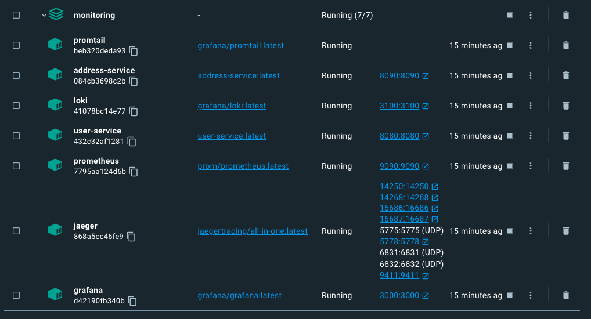

# Monitoring
This project is a proof of concept of integration between two services and the observability stack.  
Loki and promtail are used for log monitoring, jaegger with opentelemtry for traceability and finally prometheus for track metrics.  
Also a dashboard was configured as example.  


`user-service` and `address-service` are two backend kotlin microservices.  
A request made for a user in the user-service generates a call to the address-service to retrieve the address.

This example is helpful to monitor the traces between both microservices.


## How to run
### Pre-requisites
- Install Java +11 JDK
- Install Docker

1. Biuld and run
Execute the shell script that will build both of the services, create the images and then it will run the docker-compose with all the stack:
```shell
./buildandrun.sh
````
The foloowing containers should be created  


2. Once the containers are up and running, you have to create a new user:
```shell
curl --location 'http://localhost:8080/users' \
--header 'Content-Type: application/json' \
--data-raw '{
    "name": "John Doe",
    "email": "jdoe@mail.com",
    "address":[
        {
            "type":"HOME",
            "street":"123 fake st.",
            "zipcode": "73344",
            "country":"United States",
            "city":"Austin"
        }
    ]
}'
````

3. You can check what happened accessing Grafana at
```url
http://localhost:3000
```

4. To lookup the logs for the user created, in Grafana select Explore and then choose Loki from the source dropdown.
On Label filters you can choose job and select the user-service. This means that you will lookup into the user-service logs, then you only need to type what should contain the line to search, in this case "jdoe" because that is the email for the created user in the previous step.


**Note that you can expand the log founded and there is a link to Jaegger for the trace.

5. You can select another source like Prometheus or Jaeger for metrics and traces.
